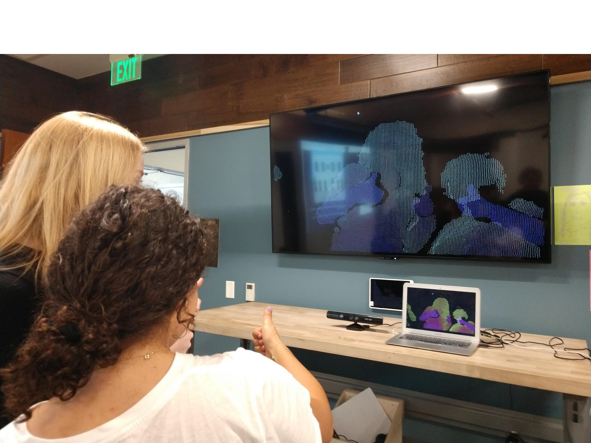

# **Gabi Becher's Portfolio**

## Welcome to my portfolio. Displayed here are a few projects I've been working on recently.

 
### An interactive display using particles and depth data from a Kinect sensor

<!---->
<iframe width="560" height="315" src="https://www.youtube.com/embed/8Jt3yuVapsU" frameborder="0" allow="accelerometer; autoplay; encrypted-media; gyroscope; picture-in-picture" allowfullscreen>

 
### A terrain created in 3D using Perlin noise. Compatible in Virtual Reality for Android.

<!--<canvas data-processing-sources="terrain/Sphere.pde terrain/terrain.pde"
    style="display:block; margin-left:auto; margin-right:auto;"></canvas>-->

 
### An animation of cubes; controllable with left/right/up/down arrows

<canvas data-processing-sources="ProjCube/Cube.pde ProjCube/ProjCube.pde"
    style="display:block; margin-left:auto; margin-right:auto;"></canvas>

 
### A website I helped design and develop to engage youth voters in California's 25th district prior to the midterm elections

<blockquote class="embedly-card"><h4><a href="https://www.anewtide.org/">A New Tide</a></h4>
© 2018 by A New Tide. All Rights Reserved. Privacy Policy.
</blockquote>

<!--<https://www.anewtide.org/>-->
