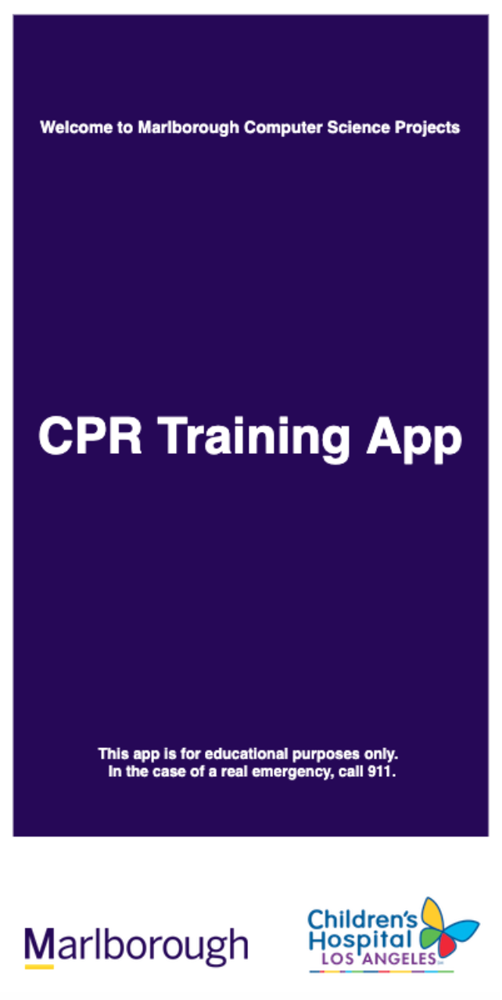

# **Gabi Becher's Computer Science Portfolio**

## Welcome to my portfolio! Displayed here are my favorite projects I've worked on.

### Currently working on:  
###  *projections for my school's dance concert   *my Honors Research in Science project, examining the state voter file in conjunction with Census data to precisely pinpoint the demographics of the unregistered yet voting-eligible population in North Carolina, where these unregistered people live, and how that data correlates to barriers to voting and registration across the state  

 
### An interactive display using particles and depth data from a Kinect sensor (coded in Processing in Java)

<iframe width="560" height="315" src="https://www.youtube.com/embed/8Jt3yuVapsU" frameborder="0" allow="accelerometer; autoplay; encrypted-media; gyroscope; picture-in-picture" allowfullscreen></iframe>

 
### A terrain created in 3D using Perlin noise. Compatible in Virtual Reality for Android. (coded in Processing)

<!--<canvas data-processing-sources="terrain/Sphere.pde terrain/terrain.pde"
    style="display:block; margin-left:auto; margin-right:auto;"></canvas>-->

 
### An animation of cubes; quantity of cubes controllable with up/down arrow keys; speed of cubes controllable with left/right arrow keys (coded in Processing)

<canvas data-processing-sources="ProjCube/Cube.pde ProjCube/ProjCube.pde"
    style="display:block; margin-left:auto; margin-right:auto;"></canvas>

 
### A website I collaborated on to engage youth voters in California's 25th Congressional district prior to the 2018 midterm elections (coded in HTML; click image to view site)

### A CPR training app I helped develop with my Computer Science Class in partnership with The Children's Hospital Los Angeles (coded in Processing; click image to view web version of application)

<a href="https://www.marlborough.org/news/~board/stem/post/from-vr-to-cpr" target="_blank" >Linked here is an article in my school's publication that I am quoted in about my Honors Computer Science Projects class</a>
